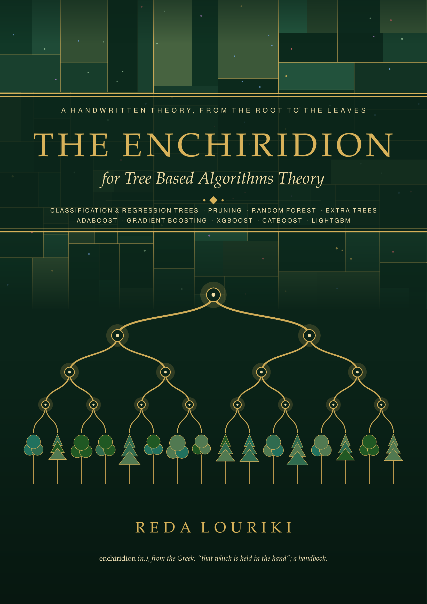
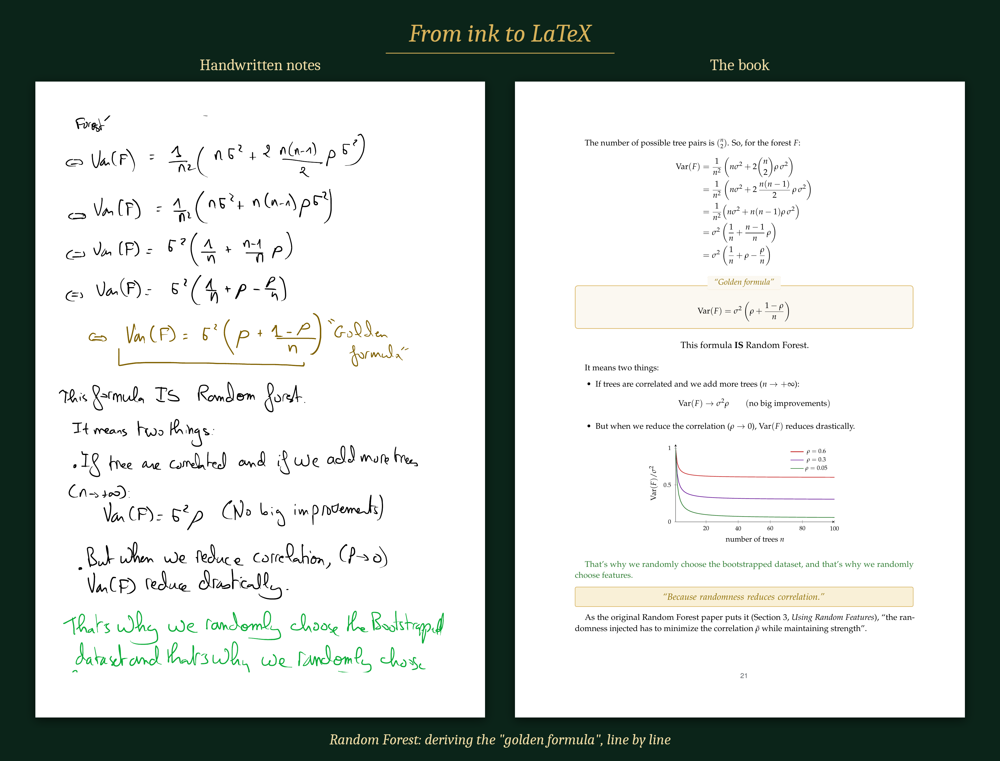

  

<h1 align="center">The Enchiridion for Tree Based Algorithms Theory</h1>

  <i>A handwritten theory of tree-based machine learning, from the root to the leaves.</i> 
  <b>Reda Louriki</b>

  <a href="The-Enchiridion-for-Tree-Based-Algorithms-Theory.pdf"><b>📖 Download the book (PDF, free)</b></a>

---

## About

This book started as handwritten notes. In the summer of 2026, I wrote the full theory of tree-based algorithms by hand, one chapter at a time. I wanted to understand *why* every formula is what it is, not only how to call `model.fit()`.

It covers the path from a single decision tree to the gradient-boosting libraries that win machine learning competitions. Every idea comes with a small example computed by hand, and every demonstration is written out in full.

> *Enchiridion* (Greek): "that which is held in the hand", a handbook.
> The name fits twice: it is a small book to keep close, and it was written by hand.

## What you'll learn

- **Where the Gini impurity comes from**: it's the probability of drawing a *mixed* pair.
- **Why a Random Forest beats a single tree**: the "golden formula"
  `Var(F) = σ²(ρ + (1 − ρ)/n)`, which says that randomness reduces correlation.
- **Why it's called *gradient* boosting**: each tree predicts the negative gradient of the loss.
- **How XGBoost, CatBoost and LightGBM improve GBDT**: similarity scores and regularization, ordered target encoding and oblivious trees, histograms, EFB, GOSS and leaf-wise growth.

## Contents

| # | Chapter | Highlights |
|---|---------|------------|
| I | Classification Trees | CART, Gini impurity (derived), weighted Gini, stopping conditions, ID3 / C4.5, entropy, information gain |
| II | Regression Trees | Splitting by SSR, leaf averages, multiple features |
| III | Cost Complexity Pruning | `L = I + α\|T\|`, the sequence of α values, K-fold cross validation |
| IV | Random Forest | Bootstrapping, the e⁻¹ ≈ 36.8% out-of-bag math, bagging, OOB score, variance derivation |
| V | Extra Trees | Random thresholds, no bootstrap |
| VI | AdaBoost | Amount of say, sample re-weighting, weighted resampling |
| VII | Gradient Boosting | Regression and classification, pseudo-residuals, leaf values, "why gradient?" |
| VIII | XGBoost | Similarity score, gain, λ and γ, output values |
| IX | CatBoost | Target leakage, ordered target encoding, cosine similarity, oblivious trees |
| X | LightGBM | Histograms, EFB, GOSS, leaf-wise growth |

## From ink to LaTeX

  

- **Content:** written by hand by **Reda Louriki**. The explanations, examples and demonstrations are mine.
- **Typesetting:** the handwritten notes were transcribed into LaTeX with the help of AI (**Claude Opus 5.5**). My wording and examples were kept. Only grammar and math errors were corrected.
- **Transparency:** every correction that changes a number, a formula, a name or a date is marked with an **Editor's note** footnote. The full list is in *Notes on this Edition* at the end of the book.
- **Colour code:** the book keeps the colours of my ink:
  - red for chapter and section titles and warnings;
  - purple for algorithm steps;
  - blue for questions to the reader;
  - green for remarks;
  - gold for key sentences.

## Acknowledgements

- **StatQuest with Josh Starmer**, whose videos helped me learn several of these ideas.
- **Leo Breiman**, *Random Forests* (2001); **J. H. Friedman**, *Greedy Function Approximation: A Gradient Boosting Machine* (2001); **Geurts, Ernst & Wehenkel**, *Extremely Randomized Trees* (2006); and the XGBoost, CatBoost and LightGBM papers.

If the book helped you, a ⭐ on the repo is appreciated.

## License

© 2026 Reda Louriki. Released under [CC BY-NC-SA 4.0](https://creativecommons.org/licenses/by-nc-sa/4.0/): you may share and adapt it with attribution, for non-commercial use, under the same license.
